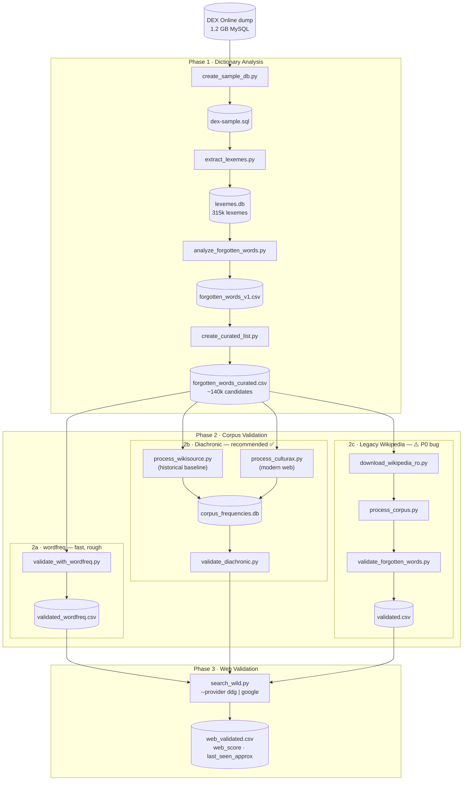
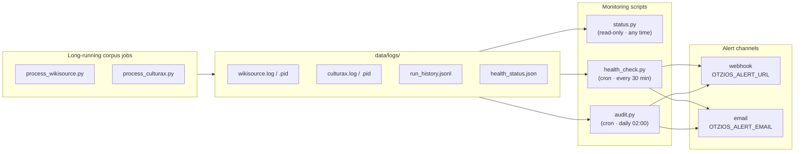

# Oțios - Romanian Forgotten Words Finder

Vezi și: [initial specs](docs/oțios-init-specs.docx.md) / [live](https://docs.google.com/document/d/1FTMIONmSylQDaV4YxFprd8jyHxREXpcL/) (google doc) 

A computational linguistics tool to identify "forgotten" Romanian words - terms that exist in official dictionaries but have fallen out of modern usage.

**Status**: 🚧 Phase 2 In Progress - Corpus Validation Ready

## What It Does

- Generates a list of the *least used* or forgotten words from Romanian dictionaries
- Compares official dictionaries (including archaisms) against usage frequency data
- Identifies linguistic "dark matter" - words that exist in dictionaries but have fallen out of active use
- Produces curated lists with rarity scores and linguistic metadata

## Pipeline

### End-to-end flow



> **Phase 2 paths are alternatives** — run 2a for a quick pass, 2b for the recommended diachronic analysis (historical vs modern corpora), or 2c only if reproducing earlier results (it has a known P0 bug).

## Quick Start

### Prerequisites

```bash
# Activate virtual environment
source ~/devbox/envs/otzios/bin/activate

# Install required packages for Phase 2
pip install datasets
```

### Phase 1: Dictionary Analysis

```bash
# 1. Create sample database (reduces 1.2GB to 285MB)
python create_sample_db.py

# 2. Extract lexeme data (creates CSV + SQLite database)
python extract_lexemes.py

# 3. Generate analysis and statistics
python analyze_forgotten_words.py

# 4. Create final curated list
python create_curated_list.py
```

**Output**: `forgotten_words_curated.csv` (~140k candidates)

### Phase 2a: Quick frequency screen (wordfreq)

```bash
python validate_with_wordfreq.py
```

**Output**: `forgotten_words_validated_wordfreq.csv` — 1,868 candidates with Zipf < 3.0. Note: wordfreq's Romanian coverage is binary (a word is either in its top ~1,500 or returns 0.000), so treat this as a rough first pass, not a nuanced frequency measure.

### Phase 1b: Taxonomy extraction (run once after Phase 1)

Extracts `Tag`, `ObjectTag`, and `EntryLexeme` tables from the DEX dump into `lexemes.db`, enabling register/domain/etymology/POS columns in the diachronic output.

```bash
# Sample dump (fast, ~5% coverage)
python extract_taxonomy.py

# Full dump (recommended — ~990k ObjectTag rows, full coverage)
python extract_taxonomy.py --sql data/dictionaries/dex-database.sql
```

### Phase 2b: Corpus validation — diachronic (recommended)

Uses Wikisource RO (historical literary baseline) and CulturaX RO (modern web) to compute actual per-corpus frequencies. Designed to find words that appear in 19th-century literature but are absent from modern text.

```bash
# Wikisource — test run (500 docs, ~10s)
python process_wikisource.py --test

# Wikisource — full run (best on a VPS)
mkdir -p data/logs
nohup python process_wikisource.py --resume >> data/logs/wikisource.log 2>&1 &
echo $! > data/logs/wikisource.pid

# CulturaX — full run (64 parquet shards, ~40M docs; auto-restarts on network errors)
# Interactive (watch it run):
while true; do
    python -u process_culturax.py --resume
    [ $? -eq 0 ] && break
    echo "[$(date)] restarting in 15s..." && sleep 15
done

# Background (logs to file):
VENV=~/g2-dev/monitorulpreturilor/venv/bin/python
mkdir -p data/logs
nohup bash -c "while true; do $VENV -u process_culturax.py --resume; [ \$? -eq 0 ] && break; echo \"[\$(date)] restarting in 15s...\"; sleep 15; done" \
  >> data/logs/culturax.log 2>&1 &
echo $! > data/logs/culturax.pid
```

**Output**: `corpus_frequencies.db` with `corpus_name = 'wikisource_ro'` and `corpus_name = 'culturax_ro'`.

Note: `process_culturax.py` reads the 64 parquet shards directly via `HfFileSystem` + `pyarrow` and checkpoints at file + row-group level. This avoids the `datasets` streaming `ds.skip()` cycling bug that triggers when the checkpoint offset exceeds the dataset size.

## Monitoring



`health_check.py`, `audit.py`, and `status.py` keep tabs on long-running corpus jobs. Run them manually or via cron (see CLAUDE.md for crontab lines).

```bash
python status.py                # at-a-glance summary — corpora, artifacts, loops, audit
python health_check.py          # check liveness, stalls, log errors, completion
python audit.py                 # snapshot run history + DB quality checks
python health_check.py --dry-run  # print without alerting or writing state
```

`status.py` is read-only — safe to run any time. `health_check.py` and `audit.py` write logs and may alert.

Set `OTZIOS_ALERT_URL` (webhook) or `OTZIOS_ALERT_EMAIL` to receive push alerts.

## Data notes

**Apostrophes in the `word` column** — DEX Online encodes syllable stress using apostrophes (e.g. `bucl'e`, `băt'ârn`). These are not real Romanian words; the clean form is in `word_no_accent`. The validated output from `validate_with_wordfreq.py` uses `word_no_accent` for all lookups and moves the raw `word` column to the end of the CSV for reference.

## Output files

All generated files live under `data/processed/`. Columns shared across files have the same meaning everywhere.

**How the files relate:** `forgotten_words_curated.csv` is the *input* to corpus validation — it lists every word DEX considers non-core (frequency < 1.0) that passes basic form filters. It carries no information about actual usage; it is purely dictionary-derived. `forgotten_words_diachronic.csv` is the *output* of corpus validation — it takes every row from the curated list and adds measured frequencies from two corpora (historical Wikisource + modern CulturaX), plus a verdict. Think of curated as "candidates" and diachronic as "evidence".

### Shared columns

| Column | Description |
|---|---|
| `word` | Word form as it appears in DEX, including stress apostrophes (e.g. `bucl'e`). Use `word_no_accent` for lookups. |
| `word_no_accent` | Clean form with apostrophes removed — the canonical key for all frequency lookups. |
| `frequency` / `dex_frequency` | DEX frequency score, 0.0–1.0. **Lower = rarer.** `0.0` means the field was absent in DEX — treat it as missing data, not "rarest". |
| `rarity_category` | Bin derived from `dex_frequency`: `very_rare` (< 0.30), `rare` (0.30–0.50), `uncommon` (0.50–0.60), `standard` (0.60–1.0). `standard` means DEX considers the word canonical but corpus evidence may disagree. |
| `description` | Part-of-speech and register abbreviation from DEX (e.g. `s.n.` = neuter noun, `adj.` = adjective, `înv.` = archaic). |
| `model_type` | DEX inflection model code (e.g. `I`, `A1`). Identifies the paradigm used for conjugation/declension. |

---

### `forgotten_words_curated.csv` — Phase 1 candidates (dictionary only)

Every DEX entry with frequency < 1.0 that passes form filters (length, not a proper noun, has a word-class marker). No corpus evidence — these are *suspects*, not confirmed forgotten words. Currently ~140k rows.

| Column | Description |
|---|---|
| `notes` | Raw notes from the DEX entry (register markers, usage labels, etc.). |

---

### `forgotten_words_diachronic.csv` — Phase 2b validated output (corpus evidence)

One row per candidate from `forgotten_words_curated.csv`, enriched with measured frequencies from both corpora and a verdict. This is the file to use for any downstream analysis — it tells you *whether* each word is actually missing from modern text, and by how much.

| Column | Description |
|---|---|
| `hist_occurrences` | Raw occurrence count in the Wikisource RO corpus (historical literary baseline, ~14M tokens). |
| `hist_documents` | Number of distinct Wikisource documents containing the word. |
| `hist_ppm` | `hist_occurrences` normalised to **occurrences per million tokens** in Wikisource. |
| `modern_occurrences` | Raw occurrence count in the CulturaX RO corpus (modern web text, ~17B tokens). |
| `modern_documents` | Number of distinct CulturaX documents containing the word. |
| `modern_ppm` | `modern_occurrences` normalised to **occurrences per million tokens** in CulturaX. |
| `log_ratio` | `log₂((hist_ppm + S) / (modern_ppm + S))` where S = 0.1 per million (Laplace smoothing). **Positive = historically skewed; negative = more common today.** A value of 1.0 means the word is twice as frequent historically; −1.0 means twice as frequent now. |
| `verdict` | Categorical summary — see table below. |
| `dex_pos` | Full part-of-speech label from DEX Tag taxonomy (e.g. `substantiv neutru`, `adjectiv`, `verb`). Pipe-delimited if multiple. Empty until `extract_taxonomy.py` is run against the full dump. |
| `dex_register` | Stylistic register tags from DEX (e.g. `învechit`, `popular`, `dialectal`, `livresc`). Pipe-delimited. A word tagged `învechit` in DEX is direct editorial evidence of archaism, independent of corpus signal. |
| `dex_domain` | Subject domain tags (e.g. `muzică`, `chimie`, `medicină`, `drept`). Pipe-delimited. Useful for filtering out technical jargon. |
| `dex_etymology` | Etymology/origin tags (e.g. `grecism`, `latinism`, `anglicism`, `turcism`, `slavonism`). Pipe-delimited. |

**Verdict values:**

| Verdict | Condition |
|---|---|
| `extinct` | `hist_ppm ≥ 1.0` and `modern_ppm < 0.1` — well-attested historically, nearly absent today. |
| `declining` | `log_ratio ≥ 1.0` — at least 2× more frequent historically, but still has some modern presence. |
| `historical_only` | `hist_ppm ≥ 0.1` and `modern_ppm < 0.1` — appears in old texts but not in modern corpus. |
| `stable` | `|log_ratio| < 1.0` — similar frequency across both corpora. |
| `modern_only` | `modern_ppm ≥ 0.1` and `hist_ppm < 0.1` — not in historical texts but present today (likely a newer word or false positive). |
| `emerging` | `log_ratio ≤ −1.0` — at least 2× more frequent in modern corpus. |
| `absent` | Both `hist_ppm < 0.1` and `modern_ppm < 0.1` — too rare to appear meaningfully in either corpus. |

---

### `diachronic_shortlist_for_web.csv` — Phase 2b → Phase 3 handoff

The subset of diachronic results selected for web validation (verdicts `extinct`, `declining`, `historical_only`). Lighter schema — drops raw occurrence counts, adds `is_forgotten`.

| Column | Description |
|---|---|
| `verdict`, `log_ratio`, `hist_ppm`, `modern_ppm` | Same as in `forgotten_words_diachronic.csv`. |
| `is_forgotten` | `true` if the word meets the diachronic forgotten threshold (passed to `search_wild.py`). |

---

### `diachronic_shortlist_web_validated.csv` — Phase 3 output

All columns from the shortlist, plus web search results from `search_wild.py`.

| Column | Description |
|---|---|
| `total_results` | Approximate search result count returned by the provider for the word query. |
| `in_wild` | `true` if the provider returned at least one result — word still appears somewhere on the Romanian web. |
| `web_score` | Categorical bucket based on `total_results`. **DDG:** `0` / `alive_rare` (1–9) / `alive` (10–29) / `common` (30+). **Google:** `0` / `alive_rare` (1–9) / `alive` (10–99) / `common` (100+). |
| `top_url` | URL of the top-ranked search result, if any. |
| `last_seen_approx` | Best-effort approximate date the word was last seen on the web (parsed from result metadata; often empty). |
| `provider` | Search backend used: `ddg` (DuckDuckGo, no API key) or `google` (Google Custom Search, needs env vars). |

---

### `forgotten_words_validated_wordfreq.csv` — Phase 2a output

Quick frequency screen via the `wordfreq` library, without streaming any corpus.

| Column | Description |
|---|---|
| `lemma` | Base form produced by `simplemma.lemmatize(word, lang='ro')`. This is what gets looked up in wordfreq. |
| `zipf_frequency` | Zipf-scale frequency from wordfreq's Romanian model (roughly: 6 = very common, 3 = uncommon, 0 = not in wordfreq's list at all). **`0.0` does not mean "least common" — it means wordfreq has no signal for this word.** |
| `is_forgotten` | `true` if `zipf_frequency < 3.0`. Note: wordfreq's Romanian coverage is sparse — most obscure words return 0.0, so this is a rough filter, not a precise frequency measure. |

## Project Structure

```
otios/
├── data/
│   ├── dictionaries/       # DEX Online database (download separately)
│   └── processed/          # Generated lexeme data and results
├── docs/                   # Documentation and specifications
│   ├── scripts-guide.md    # Detailed script documentation
│   ├── romanian-forgotten-words-spec.md
│   └── results-summary.md
└── *.py                    # Processing scripts
```

## Documentation

- **[docs/scripts-guide.md](docs/scripts-guide.md)** - Comprehensive guide to all scripts
- **[docs/romanian-forgotten-words-spec.md](docs/romanian-forgotten-words-spec.md)** - Technical specification
- **[docs/results-summary.md](docs/results-summary.md)** - Analysis results and findings
- **[docs/oțios.docx.md](docs/oțios.docx.md)** - Initial brainstorming document
- more docs: PHASE2_COMPLETE.md; phase2-test-results.md; scripts-guide.md

## Sample Results

| Word | Type | Frequency | Category |
|------|------|-----------|----------|
| **bucle** | adj. | 0.030 | very_rare |
| **jălitor** | adj./s.m. | 0.070 | very_rare |
| **griere** | s.m. | 0.300 | rare |
| **celadon** | s.n. | 0.500 | uncommon |

## Data Sources

- **DEX Online Database**: Official Romanian dictionary (1.2 GB MySQL dump)
  - Download: [dexonline.ro](https://wiki.dexonline.ro/wiki/Informa%C8%9Bii#Desc%C4%83rcare)
  - 315,247 lexemes with frequency data
  - Archaic markers and linguistic metadata

## Roadmap

### misc notes / tasks

- [ ] fix mysql import - try a llm assisted import
- [ ] create another sample db with max 3 inserts per table - for analytics

### Phase 1: Dictionary Analysis (Complete ✅)
- [x] Database setup and conversion
- [x] Lexeme extraction pipeline
- [x] Frequency-based analysis
- [x] Quality filtering and curation
- [x] CSV export with ~140k candidates (cutoff raised to DEX freq < 1.0)

**Output**: `forgotten_words_curated.csv` — ~140k candidates (dictionary suspects, corpus validation is the real gate)

### Phase 2: Corpus Validation (In Progress 🚧)
- [x] Implement corpus processing pipeline
- [x] Wikipedia Romanian integration (HuggingFace)
- [x] Romanian tokenization with diacritic handling
- [x] Word frequency counting system
- [x] Cross-reference validation algorithm
- [x] Confidence scoring system
- [x] False positive detection
- [x] Test run (1,000 articles) - **Successful!**
- [ ] Full Wikipedia processing (~500k articles)
- [ ] OSCAR Romanian corpus (requires auth setup)
- [ ] Additional corpora (news, social media)

**Current Status**: Test run complete, ready for full processing
**Output**: `forgotten_words_validated.csv` - Cross-referenced with modern text

#### Phase 2 Test Results (Oct 2025)
✅ **Processed**: 1,001 Wikipedia articles (1M tokens)
✅ **Validated**: 159,543 words
✅ **False positives detected**: 1 ("online" - correctly flagged)
✅ **Performance**: 2,351 articles/second

See [docs/phase2-test-results.md](docs/phase2-test-results.md) for details.

### Phase 3: Enhanced Metadata
- [ ] Extract full definitions from DEX database
- [ ] Join Definition and DefinitionSimple tables
- [x] Identify archaic markers (înv., arh., reg., dial.) — `dex_register` column via Tag taxonomy
- [x] Extract etymology information — `dex_etymology` column (grecism, latinism, turcism…)
- [x] Add part-of-speech tagging — `dex_pos` column (substantiv neutru, adjectiv, verb…)
- [ ] Flag words with no definition body ("Fără definiție." entries like *nombrilist*)
- [ ] Parse first attestation dates
- [ ] Temporal analysis (when words fell out of use)
- [ ] Link to word families and cognates

### Phase 4: Lemmatization & Advanced NLP
- [ ] Integrate Romanian lemmatizer (spaCy-ro or nlp-cube)
- [ ] Match inflected forms to base words
- [ ] Improve recall (find "frumoaselor" when searching "frumos")
- [ ] Named entity recognition for better filtering
- [ ] Semantic clustering of forgotten words

### Phase 5: User Interface & Visualization
- [ ] Web interface for browsing words
  - Search and filter by frequency, category
  - Word detail pages with definitions
  - Corpus occurrence examples
- [ ] REST API for programmatic access
- [ ] Interactive visualizations
  - Frequency distribution charts
  - Word cloud of forgotten words
  - Temporal decay graphs
  - Etymological origin breakdowns
- [ ] Export functionality (JSON, PDF, LaTeX)

### Future Enhancements
- [ ] Revival potential scoring algorithm
- [ ] Compare with other Romance languages
- [ ] Historical corpus analysis (Project Gutenberg)
- [ ] Machine translation of forgotten word contexts
- [ ] Crowdsourced validation platform
- [ ] Word-of-the-day feature
- [ ] Educational tools and quizzes
- [ ] Create a reverse, browse news and r/romania and find new words, used more than 3? times that are not in dictionary -> alternative dictionary

### Further enhancements, marketing
- tools: convert texts to archaic form - less used words. with a coeficient of uniqueness (bigger number, harder words)
- filter out uninteresting words. Too domain specific: medicine, biology etc
- one word a day game? quizz, guess what it means?

## Known Issues & Limitations

### Current Limitations
1. **No lemmatization**: Only exact word matching (misses inflected forms)
2. **OSCAR access**: Requires HuggingFace authentication (gated dataset)
3. **Small test corpus**: Only 1k articles tested so far
4. **No definitions yet**: Metadata not extracted from DEX database
5. **False positives**: Modern borrowings (burger, online) need better filtering

### Planned Improvements
1. **Filter refinement**:
   - Add modern borrowing detection (English/French loanwords)
   - Improve proper noun filtering
   - Better compound word handling
   - Technical term detection

2. **Corpus expansion**:
   - Full Wikipedia processing (500k articles)
   - OSCAR Romanian (250k documents)
   - Romanian news archives
   - Social media (Reddit r/Romania)
   - Historical texts for temporal analysis

3. **Performance optimization**:
   - Parallel processing for corpus streaming
   - Batch tokenization
   - Index optimization for large-scale queries

## Next Steps

### Immediate (Ready to Run)
```bash
# Process full Wikipedia corpus
python process_corpus.py --full --wikipedia-only

# Validate with full dataset
python validate_forgotten_words.py
```

### Short-term (Next Sprint)
1. Run full Wikipedia validation
2. Set up HuggingFace authentication for OSCAR
3. Extract definitions from DEX database
4. Manual review of questionable words
5. Improve filtering rules based on findings

### Medium-term (Next Month)
1. Integrate Romanian lemmatizer
2. Add more corpora sources
3. Extract full metadata (etymology, attestation dates)
4. Create basic web interface prototype
5. Write academic paper on findings

## Contributing

See [CLAUDE.md](CLAUDE.md) for development guidelines and project context.

## License

[License TBD]
