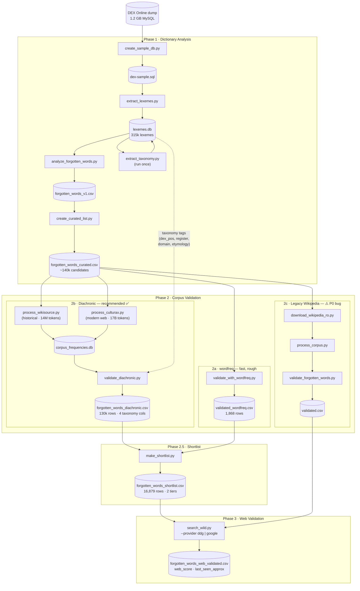
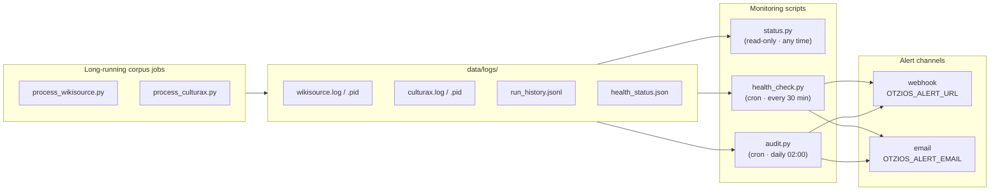

# Oțios - Romanian Forgotten Words Finder

Exploratory UI: [lab.gov2.ro/oțios](https://lab.gov2.ro/otios/)

<mark>[⚠️NOTE]</mark> Data still needs some finetunning and QA.

----

Vezi și: [initial specs](docs/oțios-init-specs.docx.md) / [live](https://docs.google.com/document/d/1FTMIONmSylQDaV4YxFprd8jyHxREXpcL/) (google doc) 

A computational linguistics tool to identify "forgotten" Romanian words - terms that exist in official dictionaries but have fallen out of modern usage.

**Status**: 📚 Definitions + 🔍 Phase 3 + 🌐 Web UI (PHP) — shortlist generated, definitions complete, web validation next

## What It Does

- Generates a list of the *least used* or forgotten words from Romanian dictionaries
- Compares official dictionaries (including archaisms) against usage frequency data
- Identifies linguistic "dark matter" - words that exist in dictionaries but have fallen out of active use
- Produces curated lists with rarity scores and linguistic metadata

## Pipeline

### End-to-end flow



> **Phase 2 paths are alternatives** — run 2a for a quick pass, 2b for the recommended diachronic analysis (historical vs modern corpora), or 2c only if reproducing earlier results (it has a known P0 bug). `make_shortlist.py` (Phase 2.5) filters the 130k diachronic rows down to the ~17k most defensible forgotten words before web validation.

## Quick Start

### Prerequisites

```bash
# Activate virtual environment (adjust path to your venv)
source ~/devbox/envs/240826/bin/activate

# Install all dependencies
pip install -r requirements.txt
```

### Phase 1: Dictionary Analysis

```bash
# 1. Create sample database (reduces 1.2GB to 285MB)
python create_sample_db.py

# 2. Extract lexeme data (creates CSV + SQLite database)
python extract_lexemes.py

# 3. Generate analysis and statistics
python analyze_forgotten_words.py

# 4. Create final curated list
python create_curated_list.py
```

**Output**: `forgotten_words_curated.csv` (~140k candidates)

### Phase 2a: Quick frequency screen (wordfreq)

```bash
python validate_with_wordfreq.py
```

**Output**: `forgotten_words_validated_wordfreq.csv` — 1,868 candidates with Zipf < 3.0. Note: wordfreq's Romanian coverage is binary (a word is either in its top ~1,500 or returns 0.000), so treat this as a rough first pass, not a nuanced frequency measure.

### Phase 1b: Taxonomy extraction (run once after Phase 1)

Extracts `Tag`, `ObjectTag`, and `EntryLexeme` tables from the DEX dump into `lexemes.db`, enabling register/domain/etymology/POS columns in the diachronic output.

```bash
# Sample dump (fast, ~5% coverage)
python extract_taxonomy.py

# Full dump (recommended — ~990k ObjectTag rows, full coverage)
python extract_taxonomy.py --sql data/dictionaries/dex-database.sql
```

### Phase 2b: Corpus validation — diachronic (recommended)

Uses Wikisource RO (historical literary baseline) and CulturaX RO (modern web) to compute actual per-corpus frequencies. Designed to find words that appear in 19th-century literature but are absent from modern text.

```bash
# Wikisource — test run (500 docs, ~10s)
python process_wikisource.py --test

# Wikisource — full run (best on a VPS)
mkdir -p data/logs
nohup python process_wikisource.py --resume >> data/logs/wikisource.log 2>&1 &
echo $! > data/logs/wikisource.pid

# CulturaX — full run (64 parquet shards, ~40M docs; auto-restarts on network errors)
# Interactive (watch it run):
while true; do
    python -u process_culturax.py --resume
    [ $? -eq 0 ] && break
    echo "[$(date)] restarting in 15s..." && sleep 15
done

# Background (logs to file):
VENV=~/g2-dev/monitorulpreturilor/venv/bin/python
mkdir -p data/logs
nohup bash -c "while true; do $VENV -u process_culturax.py --resume; [ \$? -eq 0 ] && break; echo \"[\$(date)] restarting in 15s...\"; sleep 15; done" \
  >> data/logs/culturax.log 2>&1 &
echo $! > data/logs/culturax.pid
```

**Output**: `corpus_frequencies.db` with `corpus_name = 'wikisource_ro'` and `corpus_name = 'culturax_ro'`.

Note: `process_culturax.py` reads the 64 parquet shards directly via `HfFileSystem` + `pyarrow` and checkpoints at file + row-group level. This avoids the `datasets` streaming `ds.skip()` cycling bug that triggers when the checkpoint offset exceeds the dataset size.

### Phase 2b continued: diachronic comparison + shortlist

```bash
# Compare historical vs modern frequencies, add taxonomy columns
python validate_diachronic.py
# Output: forgotten_words_diachronic.csv (130k rows)

# Filter down to the most defensible forgotten words
python make_shortlist.py --stats   # preview counts by tier
python make_shortlist.py           # write forgotten_words_shortlist.csv (~17k rows)
```

### Phase 2.5: Fill definition gaps from dexonline.ro

The DEX MySQL dump's `DefinitionSimple` table only covers ~4.6k of the 17.4k shortlist words. `scrape_definitions.py` fills the remaining gaps by extracting the synthesis (definition) from dexonline.ro for each missing word.

```bash
# Smoke test (5 words, no HTTP)
python scrape_definitions.py --dry-run --limit 5

# Small live run (test the scraper)
python scrape_definitions.py --limit 20 --delay 3.0

# Full run (all missing words, ~5–7 hours at 3s/request)
python scrape_definitions.py --delay 3.0 --merge

# Resume an interrupted run
python scrape_definitions.py --delay 3.0 --merge      # automatically skips already-scraped

# Just upsert checkpoint into DB (if scraping completed but merge wasn't run)
python scrape_definitions.py --merge-only
```

**Output**: `data/processed/scraped_definitions.csv` (checkpoint with columns: `word, definition, source_url, scraped_at, status`). With `--merge`, all `status=ok` rows are upserted into `definitions.db` immediately. Resume is safe — each row is flushed instantly; Ctrl+C stops cleanly.

### Phase 3: Web validation

```bash
# Dry run first
python search_wild.py --input data/processed/forgotten_words_shortlist.csv \
    --provider ddg --limit 5 --dry-run

# DDG triage (no API key, good for first pass)
python search_wild.py --input data/processed/forgotten_words_shortlist.csv \
    --provider ddg --limit 200 --delay 2

# Google CSE (cleaner results, needs env vars, 100/day free tier)
export GOOGLE_API_KEY="AIza..."
export GOOGLE_CSE_ID="017576..."
python search_wild.py --input data/processed/forgotten_words_shortlist.csv \
    --provider google --limit 100
```

## Monitoring



`health_check.py`, `audit.py`, and `status.py` keep tabs on long-running corpus jobs. Run them manually or via cron (see CLAUDE.md for crontab lines).

```bash
python status.py                # at-a-glance summary — corpora, artifacts, loops, audit
python health_check.py          # check liveness, stalls, log errors, completion
python audit.py                 # snapshot run history + DB quality checks
python health_check.py --dry-run  # print without alerting or writing state
```

`status.py` is read-only — safe to run any time. `health_check.py` and `audit.py` write logs and may alert.

Set `OTZIOS_ALERT_URL` (webhook) or `OTZIOS_ALERT_EMAIL` to receive push alerts.

## Data notes

**Apostrophes in the `word` column** — DEX Online encodes syllable stress using apostrophes (e.g. `bucl'e`, `băt'ârn`). These are not real Romanian words; the clean form is in `word_no_accent`. The validated output from `validate_with_wordfreq.py` uses `word_no_accent` for all lookups and moves the raw `word` column to the end of the CSV for reference.

## Output files

All generated files live under `data/processed/`. Columns shared across files have the same meaning everywhere.

**How the files relate:**

```
forgotten_words_curated.csv    — 140k dictionary suspects (no corpus signal)
        ↓ validate_diachronic.py
forgotten_words_diachronic.csv — 130k rows with corpus frequencies + taxonomy
        ↓ make_shortlist.py
forgotten_words_shortlist.csv  — ~17k most defensible forgotten words (2 tiers)
        ↓ search_wild.py
forgotten_words_web_validated.csv — shortlist + real-world web presence
```

### Shared columns

| Column | Description |
|---|---|
| `word` | Word form as it appears in DEX, including stress apostrophes (e.g. `bucl'e`). Use `word_no_accent` for lookups. |
| `word_no_accent` | Clean form with apostrophes removed — the canonical key for all frequency lookups. |
| `frequency` / `dex_frequency` | DEX frequency score, 0.0–1.0. **Lower = rarer.** `0.0` means the field was absent in DEX — treat it as missing data, not "rarest". |
| `rarity_category` | Bin derived from `dex_frequency`: `very_rare` (< 0.30), `rare` (0.30–0.50), `uncommon` (0.50–0.60), `standard` (0.60–1.0). `standard` means DEX considers the word canonical but corpus evidence may disagree. |
| `description` | Part-of-speech and register abbreviation from DEX (e.g. `s.n.` = neuter noun, `adj.` = adjective, `înv.` = archaic). |
| `model_type` | DEX inflection model code (e.g. `I`, `A1`). Identifies the paradigm used for conjugation/declension. |

---

### `forgotten_words_curated.csv` — Phase 1 candidates (dictionary only)

Every DEX entry with frequency < 1.0 that passes form filters (length, not a proper noun, has a word-class marker). No corpus evidence — these are *suspects*, not confirmed forgotten words. Currently ~140k rows.

| Column | Description |
|---|---|
| `notes` | Raw notes from the DEX entry (register markers, usage labels, etc.). |

---

### `forgotten_words_diachronic.csv` — Phase 2b validated output (corpus evidence)

One row per candidate from `forgotten_words_curated.csv`, enriched with measured frequencies from both corpora and a verdict. This is the file to use for any downstream analysis — it tells you *whether* each word is actually missing from modern text, and by how much.

| Column | Description |
|---|---|
| `hist_occurrences` | Raw occurrence count in the Wikisource RO corpus (historical literary baseline, ~14M tokens). |
| `hist_documents` | Number of distinct Wikisource documents containing the word. |
| `hist_ppm` | `hist_occurrences` normalised to **occurrences per million tokens** in Wikisource. |
| `modern_occurrences` | Raw occurrence count in the CulturaX RO corpus (modern web text, ~17B tokens). |
| `modern_documents` | Number of distinct CulturaX documents containing the word. |
| `modern_ppm` | `modern_occurrences` normalised to **occurrences per million tokens** in CulturaX. |
| `log_ratio` | `log₂((hist_ppm + S) / (modern_ppm + S))` where S = 0.1 per million (Laplace smoothing). **Positive = historically skewed; negative = more common today.** A value of 1.0 means the word is twice as frequent historically; −1.0 means twice as frequent now. |
| `verdict` | Categorical summary — see table below. |
| `dex_pos` | Full part-of-speech label from DEX Tag taxonomy (e.g. `substantiv neutru`, `adjectiv`, `verb`). Pipe-delimited if multiple. Empty until `extract_taxonomy.py` is run against the full dump. |
| `dex_register` | Stylistic register tags from DEX (e.g. `învechit`, `popular`, `dialectal`, `livresc`). Pipe-delimited. A word tagged `învechit` in DEX is direct editorial evidence of archaism, independent of corpus signal. |
| `dex_domain` | Subject domain tags (e.g. `muzică`, `chimie`, `medicină`, `drept`). Pipe-delimited. Useful for filtering out technical jargon. |
| `dex_etymology` | Etymology/origin tags (e.g. `grecism`, `latinism`, `anglicism`, `turcism`, `slavonism`). Pipe-delimited. |

**Verdict values:**

| Verdict | Condition |
|---|---|
| `extinct` | `hist_ppm ≥ 1.0` and `modern_ppm < 0.1` — well-attested historically, nearly absent today. |
| `declining` | `log_ratio ≥ 1.0` — at least 2× more frequent historically, but still has some modern presence. |
| `historical_only` | `hist_ppm ≥ 0.1` and `modern_ppm < 0.1` — appears in old texts but not in modern corpus. |
| `stable` | `|log_ratio| < 1.0` — similar frequency across both corpora. |
| `modern_only` | `modern_ppm ≥ 0.1` and `hist_ppm < 0.1` — not in historical texts but present today (likely a newer word or false positive). |
| `emerging` | `log_ratio ≤ −1.0` — at least 2× more frequent in modern corpus. |
| `absent` | Both `hist_ppm < 0.1` and `modern_ppm < 0.1` — too rare to appear meaningfully in either corpus. |

---

### `forgotten_words_shortlist.csv` — Phase 2.5 filtered shortlist

Generated by `make_shortlist.py` from the diachronic CSV. Two selection tiers, both with domain-tag and POS exclusions applied:

| Tier | `confidence_tier` value | Count | Criterion |
|---|---|---|---|
| A | `corpus_extinct` | ~1,137 | `verdict=extinct`, `hist_ppm > 0` |
| A | `corpus_declining` | ~5,668 | `verdict=declining`, `hist_ppm > 0` |
| A | `corpus_historical_only` | ~8,793 | `verdict=historical_only`, `hist_ppm > 0` |
| B | `dex_invechit_absent` | ~1,281 | `verdict=absent` + `dex_register=învechit` |

Tier B words have two independent signals of archaism: DEX editors explicitly tagged them as archaic, *and* they never appear in either corpus. Tier A words have corpus signal; Tier B words are "dark matter" — known archaic but unattested in digitised text.

All rows carry `is_forgotten = true` (required by `search_wild.py`). Columns are a subset of the diachronic CSV plus `confidence_tier`.

---

### `forgotten_words_web_validated.csv` — Phase 3 output

All columns from the shortlist, plus web search results from `search_wild.py`.

| Column | Description |
|---|---|
| `total_results` | Approximate search result count returned by the provider for the word query. |
| `in_wild` | `true` if the provider returned at least one result — word still appears somewhere on the Romanian web. |
| `web_score` | Categorical bucket based on `total_results`. **DDG:** `0` / `alive_rare` (1–9) / `alive` (10–29) / `common` (30+). **Google:** `0` / `alive_rare` (1–9) / `alive` (10–99) / `common` (100+). |
| `top_url` | URL of the top-ranked search result, if any. |
| `last_seen_approx` | Best-effort approximate date the word was last seen on the web (parsed from result metadata; often empty). |
| `provider` | Search backend used: `ddg` (DuckDuckGo, no API key) or `google` (Google Custom Search, needs env vars). |

---

### `forgotten_words_validated_wordfreq.csv` — Phase 2a output

Quick frequency screen via the `wordfreq` library, without streaming any corpus.

| Column | Description |
|---|---|
| `lemma` | Base form produced by `simplemma.lemmatize(word, lang='ro')`. This is what gets looked up in wordfreq. |
| `zipf_frequency` | Zipf-scale frequency from wordfreq's Romanian model (roughly: 6 = very common, 3 = uncommon, 0 = not in wordfreq's list at all). **`0.0` does not mean "least common" — it means wordfreq has no signal for this word.** |
| `is_forgotten` | `true` if `zipf_frequency < 3.0`. Note: wordfreq's Romanian coverage is sparse — most obscure words return 0.0, so this is a rough filter, not a precise frequency measure. |

## Project Structure

```
otios/
├── data/
│   ├── dictionaries/       # DEX Online database (download separately)
│   └── processed/          # Generated lexeme data and results
├── docs/                   # Documentation and specifications
│   ├── scripts-guide.md    # Detailed script documentation
│   ├── romanian-forgotten-words-spec.md
│   └── results-summary.md
└── *.py                    # Processing scripts
```

## Documentation

- **[docs/scripts-guide.md](docs/scripts-guide.md)** - Comprehensive guide to all scripts
- **[docs/romanian-forgotten-words-spec.md](docs/romanian-forgotten-words-spec.md)** - Technical specification
- **[docs/results-summary.md](docs/results-summary.md)** - Analysis results and findings
- **[docs/oțios.docx.md](docs/oțios.docx.md)** - Initial brainstorming document
- more docs: PHASE2_COMPLETE.md; phase2-test-results.md; scripts-guide.md

## Sample Results

Top extinct words from the diachronic analysis (high historical frequency, near-zero modern):

| Word | Meaning | DEX freq | log₂ ratio | Register | Etymology |
|------|---------|----------|-----------|----------|-----------|
| **tibișir** | type of muslin fabric | 0.82 | 8.53 | — | franțuzism |
| **ghiftui** | to stuff oneself | 0.94 | 7.44 | — | franțuzism |
| **coșcodan** | monkey (archaic) | 0.77 | 7.15 | — | — |
| **bolboacă** | clay cooking pot | 0.94 | 6.65 | învechit | — |
| **stacan** | type of goblet | 0.90 | 7.04 | — | — |
| **ietac** | private chamber | 0.91 | 4.19 | învechit | — |

DEX-tagged archaic words with no corpus signal at all (Tier B — "dark matter"):

| Word | Meaning | DEX freq | Register |
|------|---------|----------|----------|
| **vece** | outhouse (from Ger. *Wasserklose*) | 0.99 | învechit |
| **alenă** | breath, exhalation | 0.97 | învechit |
| **hurducăi** | to jolt, to shake about | 0.95 | învechit |
| **pripoană** | tethering stake | 0.95 | învechit |

## Data Sources

- **DEX Online Database**: Official Romanian dictionary (1.2 GB MySQL dump)
  - Download: [dexonline.ro](https://wiki.dexonline.ro/wiki/Informa%C8%9Bii#Desc%C4%83rcare)
  - 315,247 lexemes with frequency data
  - Archaic markers and linguistic metadata

## Roadmap

### misc notes / tasks

- [ ] fix mysql import - try a llm assisted import
- [ ] create another sample db with max 3 inserts per table - for analytics

### Phase 1: Dictionary Analysis (Complete ✅)
- [x] Database setup and conversion
- [x] Lexeme extraction pipeline
- [x] Frequency-based analysis
- [x] Quality filtering and curation
- [x] CSV export with ~140k candidates (cutoff raised to DEX freq < 1.0)

**Output**: `forgotten_words_curated.csv` — ~140k candidates (dictionary suspects, corpus validation is the real gate)

### Phase 2: Corpus Validation (Complete ✅)
- [x] Wikisource RO corpus — 12,921 docs, 14.3M tokens (historical baseline)
- [x] CulturaX RO corpus — 40.3M docs, 17.0B tokens (modern web)
- [x] Diachronic comparison: log₂(hist_ppm / modern_ppm) per word
- [x] Taxonomy enrichment: `dex_pos`, `dex_register`, `dex_domain`, `dex_etymology`
- [x] Shortlist generation: 16,879 words across 4 confidence tiers

**Output**: `forgotten_words_diachronic.csv` (130k rows) → `forgotten_words_shortlist.csv` (17k rows)

### Phase 3: Enhanced Metadata
- [ ] Extract full definitions from DEX database
- [ ] Join Definition and DefinitionSimple tables
- [x] Identify archaic markers (înv., arh., reg., dial.) — `dex_register` column via Tag taxonomy
- [x] Extract etymology information — `dex_etymology` column (grecism, latinism, turcism…)
- [x] Add part-of-speech tagging — `dex_pos` column (substantiv neutru, adjectiv, verb…)
- [ ] Flag words with no definition body ("Fără definiție." entries like *nombrilist*)
- [ ] Parse first attestation dates
- [ ] Temporal analysis (when words fell out of use)
- [ ] Link to word families and cognates

### Phase 4: Lemmatization & Advanced NLP
- [ ] Integrate Romanian lemmatizer (spaCy-ro or nlp-cube)
- [ ] Match inflected forms to base words
- [ ] Improve recall (find "frumoaselor" when searching "frumos")
- [ ] Named entity recognition for better filtering
- [ ] Semantic clustering of forgotten words

### Phase 3: Web Validation (Next 🔍)
- [ ] DDG triage pass on shortlist (~17k words, no quota)
- [ ] Google CSE pass on high-confidence subset (100/day free tier)
- [ ] Cross-reference: corpus verdict vs web presence

### Phase 5: User Interface & Visualization
- [x] Exploratory UI for browsing the shortlist (filter by tier, POS, etymology, domain, verdict, marks)
- [x] Word detail view: DEX definition, corpus stats, dexonline.ro link
- [x] PHP thin-API port — deployable on shared hosting (`public/`, `tools/build_ui_db.py`)
- [x] localStorage bookmarks / notes / quick-tags (no server-side auth needed)
- [ ] REST API for programmatic access
- [ ] Interactive visualizations
  - Frequency decay curves (hist_ppm vs modern_ppm scatter)
  - Etymological breakdown of extinct words
  - Word cloud weighted by log_ratio

### Future Enhancements
- [ ] Revival potential scoring algorithm
- [ ] Compare with other Romance languages
- [ ] Historical corpus analysis (Project Gutenberg)
- [ ] Machine translation of forgotten word contexts
- [ ] Crowdsourced validation platform
- [ ] Word-of-the-day feature
- [ ] Educational tools and quizzes
- [ ] Create a reverse, browse news and r/romania and find new words, used more than 3? times that are not in dictionary -> alternative dictionary

### Further enhancements, marketing
- tools: convert texts to archaic form - less used words. with a coeficient of uniqueness (bigger number, harder words)
- filter out uninteresting words. Too domain specific: medicine, biology etc
- one word a day game? quizz, guess what it means?

## Known Issues & Limitations

1. **No lemmatization** — `buclele` doesn't match `bucle` in the corpus. Inflected forms are invisible. Adding `simplemma` would significantly improve recall (backlog #6).
2. **POS tag noise** — some words get wrong POS tags due to the ObjectTag join occasionally pulling tags from adjacent dictionary entries. Supplementary metadata only; doesn't affect core analysis.
3. **Sparse etymology -ism tags** — many words store "limba franceză" not "franțuzism" in DEX. Both are captured but the vocabulary is inconsistent across DEX editors.
4. **`absent` verdict ambiguity** — 83k words with no corpus signal conflate "truly unused" with "only appears in inflected forms not tracked". Lemmatization (#6) would reduce this category significantly.

## Next Steps

```bash
# Web validation — DDG triage on full shortlist
python search_wild.py --input data/processed/forgotten_words_shortlist.csv \
    --provider ddg --limit 500 --delay 2

# Or just the highest-confidence tier first
python make_shortlist.py --limit 1137   # corpus_extinct only
python search_wild.py --input data/processed/forgotten_words_shortlist.csv \
    --provider ddg --delay 2
```

See [Activity History](docs/activity-history.md) and [Backlog](docs/BACKLOG.md) for the changelong and open items / roadmap.

## Contributing

See [CLAUDE.md](CLAUDE.md) for development guidelines and project context.

 